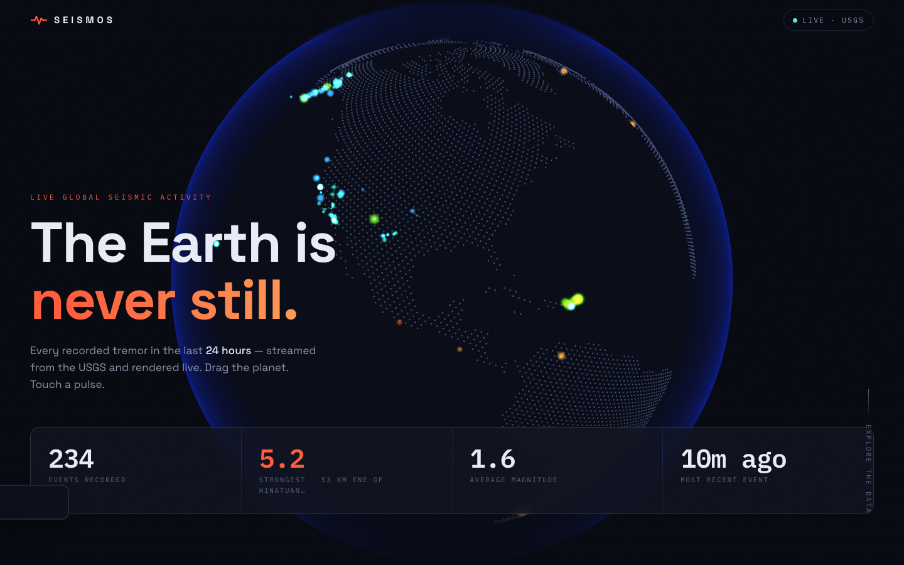

# SEISMOS — Live Earthquake Observatory

A live, awards-grade observatory of global seismic activity. Every earthquake
recorded by the **USGS** in the selected time window is streamed in and rendered
on an interactive **Three.js** globe, with **GSAP**-driven motion and two
filter-reactive **ECharts** visualizations. Drag the planet, touch a pulse,
scrub the data.



---

## Highlights

- **3D globe** (Three.js) — a precomputed land dot-grid with magnitude-colored,
  glowing quake markers, expanding shockwave rings on the most significant
  events, drag-to-rotate with inertia, auto-spin, and raycast hover tooltips.
- **Cinematic motion** (GSAP) — line-mask hero intro, scroll-reveal sections,
  and animated stat counters. Fully gated behind `prefers-reduced-motion`.
- **Two reusable charts** (ECharts) — magnitude distribution (bar) and seismic
  rhythm over time (area). Both consume a single `Summary` structure and react
  instantly to filters.
- **Sortable, infinite-scroll event log** — every column sortable; significant
  events flagged with severity badges (Watch / Strong / Major / Tsunami); rows
  link to the full USGS report.
- **Live & resilient** — auto-refreshes every 60s, surfaces a retryable error
  state, and **degrades gracefully to a styled fallback if WebGL is
  unavailable** so the data dashboard always works.
- **Responsive** — verified at 1440px desktop and 390px mobile.

---

## Tech stack & why

| Concern | Choice | Why |
| --- | --- | --- |
| Build / dev server | **Vite** + **TypeScript** | Instant HMR, ESM, tiny config, first-class TS. |
| 3D globe | **Three.js** | The brief invited Three.js; WebGL gives us a GPU-rendered point cloud of thousands of markers at 60fps. |
| Motion | **GSAP** + ScrollTrigger | Industry-standard timeline control and scroll-driven reveals. |
| Charts | **ECharts** | Canvas-rendered, performant with large series, highly themeable. |
| Data | **USGS GeoJSON summary feeds** | CDN-cached, pre-aggregated, fast — ideal for a live dashboard. |

No UI framework: the app is small and DOM-light, so vanilla TS modules keep the
bundle lean and the data flow obvious.

---

## Architecture

```
index.html              App shell + semantic markup
src/
  main.ts               Composition root: wires data → globe, charts, table; controls; motion
  styles.css            Design system (tokens, layout, responsive, reduced-motion)
  data/
    types.ts            Quake, Summary, TimeRange, EarthquakeFilters
    usgs.ts             USGS feed client (range → feed URL, fetch + parse)
    quakeUtils.ts       PURE functions: parse, filter, sort, bucket, summarize  ← unit-tested
  globe/globe.ts        Three.js scene: land dots, marker cloud, rings, pointer/raycast
  charts/charts.ts      MagnitudeChart + FrequencyChart (reusable, theme-matched)
  table/table.ts        QuakeTable: sorting + IntersectionObserver infinite scroll
  assets/land-dots.json Precomputed [lat,lon] land grid (generated, see below)
scripts/
  generate-land-dots.mjs  Builds the land grid from country polygons
  verify.mjs              Headless-Chrome (CDP) screenshot + console-error harness
tests/
  quakeUtils.test.mjs     Unit tests for the pure data layer (node:test)
```

**Data flow.** `usgs.ts` fetches a feed and maps each GeoJSON feature to a flat
`Quake`. `main.ts` holds `rawQuakes` + the current filters; on any change it runs
the pure pipeline `filterByMag → summarize` and pushes the result to every view
(`globe.setQuakes`, `magChart.update`, `freqChart.update`, `table.setData`).
Because the aggregation is pure and centralized, the views stay dumb and
consistent.

### The globe's land grid

A live "dots on landmasses" globe needs to know where land is. Rather than ship
a heavy texture or do polygon tests at runtime, `scripts/generate-land-dots.mjs`
distributes ~42k candidate points evenly over the sphere (Fibonacci spiral),
tests each against country polygons (point-in-polygon with bounding-box
rejection and hole handling), and writes the ~12k that land on land to
`src/assets/land-dots.json` (quantized, ~170 KB). Three.js renders them as a
single `Points` cloud — one draw call.

Regenerate with:

```bash
npm run generate:landdots   # expects scripts/countries.geo.json
```

---

## Getting started

Requires **Node 18+** (developed on Node 22).

```bash
npm install
npm run dev        # http://localhost:5173
```

```bash
npm run build      # type-check (tsc --noEmit) + production bundle to dist/
npm run preview    # serve the production build locally
npm test           # run the unit-test suite
```

No API key is needed — the USGS feeds are public.

---

## Tests

The correctness-critical logic lives in `src/data/quakeUtils.ts` as pure
functions, covered by `tests/quakeUtils.test.mjs` using Node's built-in test
runner (zero extra dependencies). The `pretest` step bundles the TS utilities
with esbuild (which ships with Vite) so tests import real source, not a copy.

Coverage includes feed parsing & missing-field tolerance, magnitude filtering,
sorting (with no-mutation guarantees), relative-time formatting, magnitude
bucketing, time-frequency bucketing, full summarization, and alert tiering.

```bash
npm test     # 14 tests
```

### Visual / runtime verification

`scripts/verify.mjs` drives headless Chrome over the DevTools Protocol to load
the app, collect console errors and page exceptions, exercise the controls
(range pill + magnitude slider), and capture full-page screenshots at desktop
and mobile sizes. Launch Chrome with `--remote-debugging-port=9222` first, then:

```bash
node scripts/verify.mjs http://localhost:4188/ shot.png            # desktop
node scripts/verify.mjs http://localhost:4188/ shot.png mobile     # mobile
node scripts/verify.mjs http://localhost:4188/ shot.png interact   # + filters
```

---

## Accessibility & resilience

- Respects `prefers-reduced-motion` (skips intros, freezes shockwaves/auto-spin).
- Hero copy has a JS failsafe and a `<noscript>` fallback so it's never stuck hidden.
- If WebGL can't initialize, the globe is skipped and a styled fallback is shown;
  data, charts, and the table continue to work.
- Live status badge reflects syncing / live / offline; failed loads show a retry.
- Semantic landmarks, ARIA roles on tabs/sliders/table sort headers, keyboard-
  focusable controls.

---

## Deployment

The build output in `dist/` is fully static — host it anywhere.

- **Vercel / Netlify:** build command `npm run build`, output directory `dist`.
- **GitHub Pages:** `npm run build`, publish `dist/` (the Vite `base: "./"`
  config makes asset paths relative, so it works from a subpath).
- **Any static host / CDN:** upload `dist/`.

`.github/workflows/node.js.yml` runs `npm ci → build → test` on Node 18/20/22 for
every push and PR.

---

## Data source

[USGS Earthquake Hazards Program](https://earthquake.usgs.gov/) real-time GeoJSON
summary feeds. Time windows map to: all-hour, all-day, all-week, and
2.5+-month feeds.
